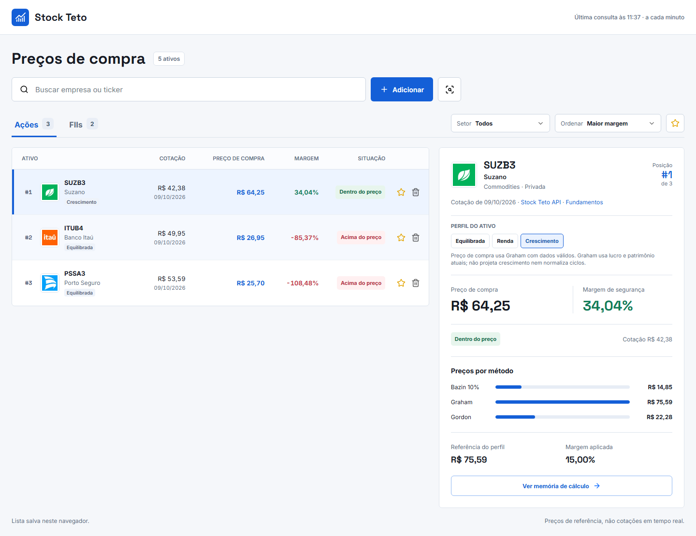
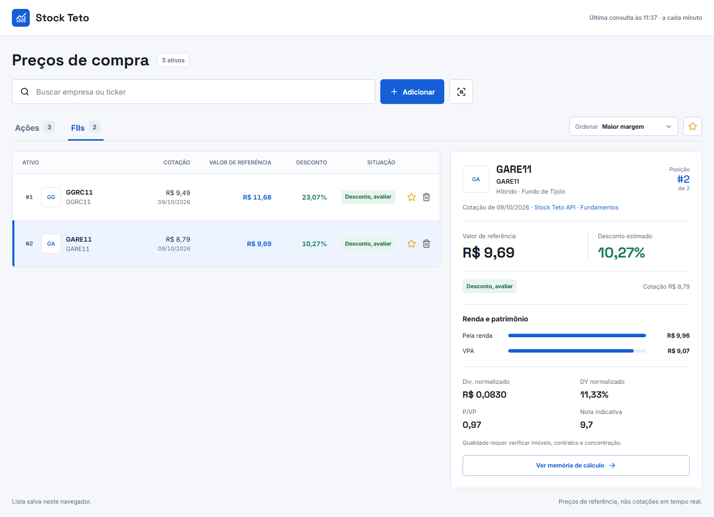

# Stock Teto

Um painel para comparar **preços de compra de ações e FIIs brasileiros**. Você escolhe os ativos que quer acompanhar; o app mostra a cotação disponível, os valores calculados por método e a margem em relação ao preço de referência. [Abrir o Stock Teto](https://stock-teto.vercel.app/).



## Como funciona

1. Busque uma empresa ou ticker e escolha **Adicionar** para colocá-la no ranking, ou **Analisar** para consultar sem salvar.
2. Alterne entre **Ações** e **FIIs**. Filtre ações por setor, ordene por margem e marque favoritos com a estrela.
3. Selecione um ativo para ver sua posição na lista e os métodos lado a lado; abra **Ver memória de cálculo** para conferir os números usados.

A lista, os favoritos e o perfil escolhido para cada ação ficam salvos **neste navegador**. O app começa vazio e não importa uma carteira automaticamente.

## Ações: um perfil para cada tese

Cada ação tem um perfil editável no painel do ativo:

| Perfil | Métodos que entram no preço de compra | Uso |
| --- | --- | --- |
| **Renda** | Bazin e Gordon | Para teses apoiadas em distribuição de dividendos. |
| **Equilibrada** | Bazin, Graham e Gordon | Para comparar renda e lucro/patrimônio sem priorizar um lado. |
| **Crescimento** | Graham | Não penaliza a ação pela ausência de dividendos. |

O app calcula os métodos para comparação, mas faz a média **somente dos métodos válidos para o perfil escolhido**. Sobre a referência resultante, aplica margem de segurança de **15% para empresas privadas** e **20% para estatais**. O perfil pode ser alterado a qualquer momento; a lista é reordenada imediatamente. **SUZB3 começa como crescimento**, e os demais ativos começam como equilibrados até você ajustar a tese.

No perfil crescimento, Graham usa **LPA e VPA atuais**. Ele não prevê crescimento futuro nem normaliza ciclos de lucro. Por isso, um preço de compra calculado não substitui a análise da empresa; se LPA ou VPA não forem válidos, o app não inventa um preço.

## FIIs: renda e patrimônio



O valor de referência combina o preço pela **renda mensal normalizada** com o **valor patrimonial por cota (VPA)**. Para fundos de tijolo, o ponto de partida é **70% renda + 30% VPA**; o painel também mostra P/VP, desconto estimado, nota indicativa e riscos disponíveis. A nota é uma triagem quantitativa, não uma verificação completa dos imóveis, contratos ou crédito.

## Dados e limites

- As cotações são consultadas pela [Stock Teto API](https://stock-teto-api.vercel.app/docs); fundamentos e histórico público vêm do Investidor10. O detalhe de cada ativo exibe as fontes e a data da cotação.
- Os ativos salvos são atualizados automaticamente quando a página está visível, com novas tentativas a cada minuto. **Isso não significa cotação em tempo real.** Uma cotação vencida ou indisponível não é apresentada como atual.
- Métodos sem dados suficientes ficam sem valor. Preços calculados são referências para estudo, **não recomendações de investimento**.

## Rodar localmente

Requer Node.js. No diretório do projeto:

```bash
npm install
npm start
```

Abra `http://localhost:3000`. Para executar os testes: `node --test tests/*.test.js`.
